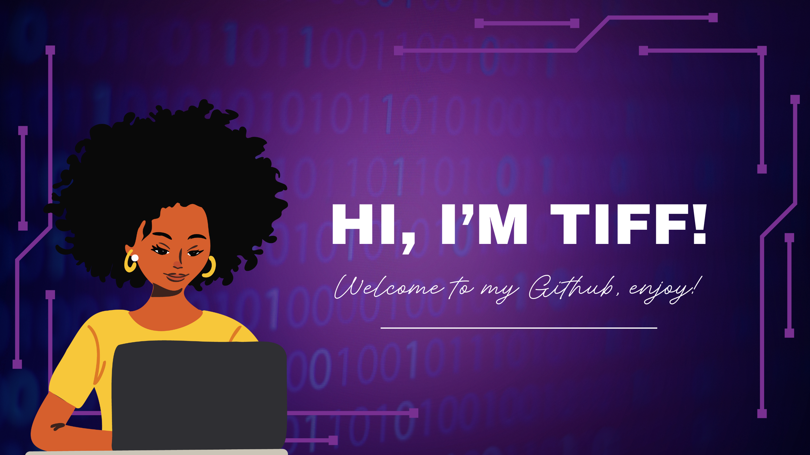

# Hey there, I'm Tiff! 👋🏾💻🔐

Welcome to my little corner of the tech universe 🌌  
I'm a **Cyber Security graduate** and **Junior Software Developer** just starting out — but full of big ideas, fresh curiosity, and lots of passion for learning! 🌱💡

This GitHub is my sandbox 🏖️ — a space where I experiment, build, break, and rebuild 🚀  
From quirky coding challenges to projects that (hopefully!) make life easier or a bit more fun, this is where you'll see my journey unfold, one repo at a time 📂✨

I'm **always open to learning**, collaborating 🤝, and growing alongside awesome devs like you!  
Outside the screen, you can find me:
- 🥾 Hiking mountain trails  
- ⛪ Recharging at church  
- 🛋️ Enjoying peaceful weekends with my amazing family  

### 🌐 Let's connect!
- 📸 <a href="https://www.instagram.com/tiffany_litha_goliath/">Instagram</a> — A little beauty, a little tech, a lot of fun!
- 💼 <a href="https://www.linkedin.com/in/monicampowell/](https://www.linkedin.com/in/tiffany-goliath-820a10243/)">LinkedIn</a> — Let's build and grow professionally
- 📬 [Email](tiffanylithagoliath@gmail.com) — Reach out anytime!

Thanks for stopping by — let’s build something great together! 🌍👩🏾‍💻
